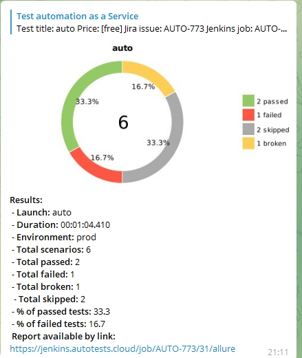

<p align="center">
  
</p>

## :cherry_blossom:	Содержание

> ➠ [Покрытый функционал](#fire-покрытый-функционал)
>
> ➠ [Технологический стек](#fleur_de_lis-технологический-стек)
>
> ➠ [Запуск тестов из терминала](#запуск-тестов-из-терминала)
>
> ➠ [Запуск тестов в Jenkins](#robot-удаленный-запуск-тестов)
>
> ➠ [Отчет о результатах тестирования в Allure Report](#skier-главная-страница-allure-отчета)
>
> ➠ [Уведомления в Telegram с использованием бота](#-уведомления-в-telegram-с-использованием-бота)
>
> ➠ [Пример запуска теста в Selenoid](#-пример-запуска-теста-в-selenoid


## :fire: Покрытый функционал

#  UI

:star_of_david: Проверка поисковой строки

:star_of_david: Проверка перехода на страницу Team

:star_of_david: Проверка отображения ошибки, если ввели неверный email

## :fleur_de_lis: Технологический стек

<p align="center">
  
  
  
  
  
  
  
  
  
</p>

# Запуск тестов из терминала
В данном проекте автотесты написаны на <code>Java</code> с использованием <code>Selenide</code> для UI-тестов.
>
> <code>Selenoid</code> выполняет запуск браузеров в контейнерах <code>Docker</code>.
>
> <code>Allure Report</code> формирует отчет о запуске тестов.
>
> Для автоматизированной сборки проекта используется <code>Gradle</code>.
>
> В качестве библиотеки для модульного тестирования используется <code>JUnit 5</code>.
>
> <code>Jenkins</code> выполняет запуск тестов.
> После завершения прогона отправляются уведомления с помощью бота в <code>Telegram</code>.


## Запуск тестов из терминала

### :robot: Локальный запуск тестов

```
gradle clean test
```

### :robot: Удаленный запуск тестов 

```
clean
test
-Dbrowser=${BROWSER}
-DbrowserVersion=${BROWSER_VERSION}
-DbrowserSize=${BROWSER_SIZE}
-DbrowserMobileView="${BROWSER_MOBILE}"
-DremoteDriverUrl=https://user1:1234@${REMOTE_DRIVER_URL}/wd/hub/
-DvideoStorage=https://${REMOTE_DRIVER_URL}/video/
-Dthreads=${THREADS}
```

### :robot: Параметры сборки

> <code>REMOTE_URL</code> – адрес удаленного сервера, на котором будут запускаться тесты.
>
> <code>BROWSER</code> – браузер, в котором будут выполняться тесты (_по умолчанию - <code>chrome</code>_).
>
> <code>BROWSER_VERSION</code> – версия браузера, в которой будут выполняться тесты (_по умолчанию - <code>91.0</code>_).
>
> <code>BROWSER_SIZE</code> – размер окна браузера, в котором будут выполняться тесты (_по умолчанию - <code>1920x1080</code>_).


### :skier: Главная страница Allure-отчета

<p align="center">

</p>

### :eye_speech_bubble: Группировка тестов по проверяемому функционалу

<p align="center">

</p>


### :frog: Основной дашборд

<p align="center">

</p>


##  Уведомления в Telegram с использованием бота

> После завершения сборки специальный бот, созданный в <code>Telegram</code>, автоматически обрабатывает и отправляет сообщение с отчетом о прогоне.

<p align="center">

</p>

##  Пример запуска теста в Selenoid

> К каждому тесту в отчете прилагается видео. Одно из таких видео представлено ниже.
<p align="center">
  
</p>


